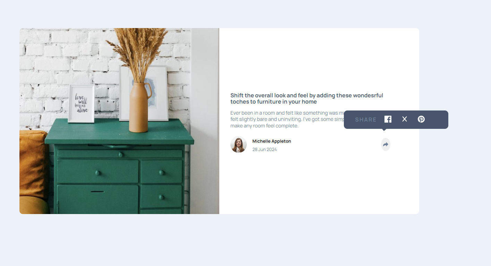

# Article-Component

## Table of contents

- [The challenge](#the-challenge)
- [Screenshot](#screenshot)
- [Links](#links)
- [My process](#my-process)
- [Built with](#built-with)
- [What I learned](#what-i-learned)
- [Author](#author)

### The challenge

Users should be able to:

- View the optimal layout for the component depending on their device's screen size
- See the social media share links when they click the share icon

# Links

[VIEW DEMO](https://miron-silviu.github.io/article-component/)

## Screenshot



## My process

I started to build the project by adding semantic HTML markup elements and then I created new file named style.css to style html elements . At the end I added functionality to share-button.
I should metioned that the project is build with mobile first in mind and is fully responsive.

## Built with

- Semantic HTML5 markup
- CSS custom properties
- Flexbox
- Mobile-first workflow
- [Styled Components](https://styled-components.com/) 

## What I learned

I imporved my skills regarding HTML and CSS and I lerned how to implement functionality for a button.

```html
<h1>Some HTML code I'm proud of</h1>
```

```css
.proud-of-this-css {
  .footer-share-menu {
    gap: 1rem;
    position: absolute;
    right: 300px;
    bottom: 450px;
    border-radius: 10px;
    max-height: 2.2vh;
    max-width: 100vw;
  }
}
```

```js
const proudOfThisFunc = () => {
  shareBtn.addEventListener('click', function () {
    const footerClass = (document.querySelector(
      '.footer-share-menu'
    ).style.visibility = 'visible');
  });
};
```

## Author

- Website - [Add your name here](https://www.your-site.com)
- Frontend Mentor - [Silviu Miorn](https://www.frontendmentor.io/home)
- Twitter - [Silviu Miron](https://x.com/silviuumiron)
